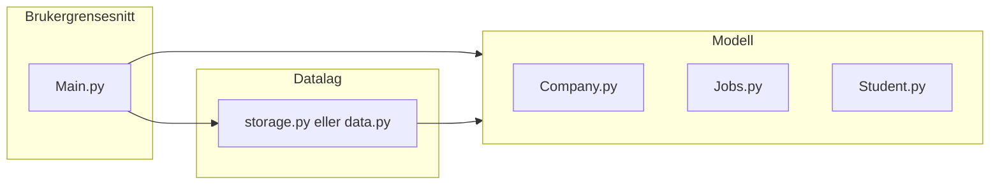

# Plan: Utvikle Student-Work-Application med forklaringer

Implementeringen følger de sju stegene fra tidligere. Under hvert steg står **Hva vi gjør** og **Hvorfor** slik at du kan bekrefte og lære underveis.

---

## Arkitektur (før vi koder)

- **Main.py** bruker datalaget og modellene; den endrer ikke lister/dicts direkte.
- **Datalaget** eier listene og dicts, og tilbyr funksjoner (register, create_job, get_by_id, matching, sortering).
- **Modellene** er kun klassedefinisjoner (Student, Company, Job); de skal ikke importere fra hverandre på en måte som skaper sirkulære avhengigheter.

Nåværende problem: [Student.py](Student-Work-Application/Model/Student.py) importerer `from Jobs import *` (bruker `all_jobs`), og [Jobs.py](Student-Work-Application/Model/Jobs.py) importerer `Company` og `comp1`. Vi flytter lagring og global data til et eget datalag og fjerner testkode fra modellfilene.

---

## Steg 1: Datalag med lister og dicts

**Hva vi gjør**

- Opprette en ny fil for datalaget, f.eks. [Student-Work-Application/data.py](Student-Work-Application/data.py) (i roten av prosjektet, slik at både Main og Model kan importere den uten å endre mange stier), eller [Student-Work-Application/Model/storage.py](Student-Work-Application/Model/storage.py).
- I den filen definere:
  - `students = []` og `students_by_id = {}`
  - `companies = []` og `companies_by_id = {}`
  - `jobs = []` og `jobs_by_id = {}`
- Ingen andre filer skal ha egne globale `all_jobs`/`comp1` som «eier» data; det skal skje i datalaget.

**Hvorfor**

- Oppgaven krever både lister (for iterasjon, filtering, sortering) og dicts (for rask oppslag på ID). Ved å samle dem ett sted unngår vi duplisering og sirkulære importer.
- Dict-oppslag på ID er O(1); liste-iterasjon er O(n). Dette er grunnlaget for kompleksitetsanalysen i rapporten.

---

## Steg 2: Registrering (studenter og bedrifter)

**Hva vi gjør**

- I datalaget implementere:
  - `register_student(student_id, name, email, skills)` – oppretter en `Student` (vi kan beholde `age` og `year` som valgfrie argumenter med default, eller fjerne dem for å matche oppgaveteksten nærmere; oppgaven nevner id, name, email, skills). Legger studenten i `students` og `students_by_id[student_id]`. Returnerer studenten.
  - `register_company(company_id, name, email)` – tilsvarende for `Company`: legg i `companies` og `companies_by_id[company_id]`. Returnerer bedriften.

**Hvorfor**

- Registrering er inngangen for at brukere kommer «inn i systemet». Ved å lagre i både liste og dict får vi O(1)-oppslag senere og kan iterere over alle brukere når vi trenger det (f.eks. matching company → students).

---

## Steg 3: Opprette jobber (create_job)

**Hva vi gjør**

- I datalaget implementere `create_job(job_id, title, description, required_skills, budget, company_id)`:
  - Hente bedrift med `companies_by_id.get(company_id)`. Hvis ikke funnet, kan vi returnere None eller raise.
  - Opprette et `Job`-objekt (status f.eks. `"open"`) med company_id og evt. referanse til company-objektet (for bakoverkompatibilitet med eksisterende [Jobs.py](Student-Work-Application/Model/Jobs.py)).
  - Legge jobben i `jobs` og `jobs_by_id[job_id]`. Returnere jobben.

**Hvorfor**

- Oppgaven beskriver at bedrifter publiserer oppgaver; `create_job` er den eneste måten nye jobber skal komme inn. Ved å bruke `company_id` og dict-oppslag er oppslag O(1).

---

## Steg 4: Oppslag på ID (get_*_by_id)

**Hva vi gjør**

- I datalaget implementere:
  - `get_student_by_id(student_id)` → `students_by_id.get(student_id)`
  - `get_company_by_id(company_id)` → `companies_by_id.get(company_id)`
  - `get_job_by_id(job_id)` → `jobs_by_id.get(job_id)`

**Hvorfor**

- Matching og andre funksjoner trenger «hent bruker/jobb med denne ID». Én dict-oppslag er O(1); dette er de konkrete stedene dere kan vise i rapporten med skjermbilder.

---

## Steg 5: Matching og filtrering

**Hva vi gjør**

- I datalaget implementere:
  - `find_matching_jobs_for_student(student_id)`:
    - Hent student med `get_student_by_id(student_id)`.
    - Iterer over `jobs` (eller kun `status == "open"`). For hver jobb: sjekk om minst ett element i `job.required_skills` finnes i `student.skills` (f.eks. med sett-snitt: `set(job.required_skills) & set(student.skills)`).
    - Returnere liste med matchende jobber.
  - Valgfritt: `find_students_for_job(job_id)` – hent jobb, iterer over `students`, returner studenter der skills overlapper med `job.required_skills`.

I [Student.py](Student-Work-Application/Model/Student.py) fjerner vi avhengigheten til `Jobs` og `all_jobs`. Metoden `show_jobs()` kan fjernes (matching skjer i datalaget) eller beholdes som en wrapper som kaller datalaget hvis vi sender inn jobb-liste som argument; enklest er å fjerne den og bruke kun `find_matching_jobs_for_student`.

**Hvorfor**

- Matching er kjernen i oppgaven. Ved å gjøre det i datalaget unngår vi sirkulære importer og har én klar O(n)-operasjon (én gjennomgang av jobb-listen) som dere kan dokumentere i rapporten.

---

## Steg 6: Sortering etter budget

**Hva vi gjør**

- I datalaget implementere `get_jobs_sorted_by_budget(only_open=True)`:
  - Hente enten alle jobber eller kun de med `status == "open"` (én gjennomgang, O(n)).
  - Sortere med `sorted(..., key=lambda j: j.budget)` (O(n log n)).
  - Returnere den sorterte listen.

**Hvorfor**

- Oppgaven krever at studenter kan se oppgaver sortert på budget. Pythons `sorted()` er O(n log n); dette gir dere et konkret eksempel på linearithmisk tid i koden.

---

## Steg 7: Main.py og opprydding

**Hva vi gjør**

- Fjerne testkode og globale instanser fra modellfilene:
  - [Company.py](Student-Work-Application/Model/Company.py): fjern `comp1` og `print(comp1)`.
  - [Jobs.py](Student-Work-Application/Model/Jobs.py): fjern `job1`, `job2`, `job3` og `all_jobs`; behold kun klassedefinisjonen. Endre evt. klassenavn til `Job` (entall) for å matche oppgaveteksten, og bruk `company_id` i tillegg til eller i stedet for `company` hvis vi vil være nærmere rapporten.
  - [Student.py](Student-Work-Application/Model/Student.py): fjern `stud1` og alle `print`-kall; fjern eller tilpass `show_jobs()` slik at den ikke importerer fra Jobs (matching i data.py).
- Oppdatere [Jobs.py](Student-Work-Application/Model/Jobs.py) slik at den ikke lenger importerer `comp1` fra Company (jobber opprettes via `create_job` i datalaget).
- I [Main.py](Student-Work-Application/Main.py):
  - Importere modellene og datalaget (register_student, register_company, create_job, get_*_by_id, find_matching_jobs_for_student, get_jobs_sorted_by_budget).
  - Kjøre en demonstrasjonsflyt: registrere 1–2 studenter og 1 bedrift, opprette 2–3 jobber, kalle `find_matching_jobs_for_student(...)` og `get_jobs_sorted_by_budget(...)` og skrive ut resultatet. Alternativt: en enkel meny (1: Registrer student, 2: Registrer bedrift, 3: Opprett jobb, 4: Matchende jobber for student, 5: Jobber sortert på budget) som leser input og kaller de riktige funksjonene.

**Hvorfor**

- Main.py er inngangspunktet; brukeren skal kunne kjøre `python Main.py` og se at alle krav fungerer. Ryddig modellkode uten sideeffekter ved import gjør prosjektet enklere å vedlikeholde og matcher oppgavens beskrivelse av klasser og datalag.

---

## Filendringer (oversikt)

| Fil                                                     | Endringer                                                                                                                                                                                                    |
| ------------------------------------------------------- | ------------------------------------------------------------------------------------------------------------------------------------------------------------------------------------------------------------ |
| Ny: `data.py` eller `Model/storage.py`                  | Lister og dicts; register_student, register_company, create_job; get_student_by_id, get_company_by_id, get_job_by_id; find_matching_jobs_for_student, get_jobs_sorted_by_budget; evt. find_students_for_job. |
| [Company.py](Student-Work-Application/Model/Company.py) | Fjern `comp1` og `print(comp1)`.                                                                                                                                                                             |
| [Jobs.py](Student-Work-Application/Model/Jobs.py)       | Fjern job1/job2/job3 og `all_jobs`; fjern import av comp1. Evt. klassenavn til `Job` og lagre `company_id`.                                                                                                  |
| [Student.py](Student-Work-Application/Model/Student.py) | Fjern import fra Jobs; fjern eller tilpass show_jobs(); fjern stud1 og print.                                                                                                                                |
| [Main.py](Student-Work-Application/Main.py)             | Importer datalag og modell; demonstrasjonsflyt eller enkel meny.                                                                                                                                             |

---

## Rekkefølge under implementering

1. Opprett datalagsfil og definer lister/dicts (steg 1).
2. Implementer register_student og register_company (steg 2).
3. Implementer create_job (steg 3).
4. Implementer get_*_by_id (steg 4).
5. Implementer find_matching_jobs_for_student (steg 5).
6. Implementer get_jobs_sorted_by_budget (steg 6).
7. Opprydding i Model og implementering i Main.py (steg 7).

Under implementering vil jeg ved hvert steg skrive kort «Hva vi gjør» og «Hvorfor» i kommentarer eller i svaret, slik at du kan bekrefte og lære underveis.